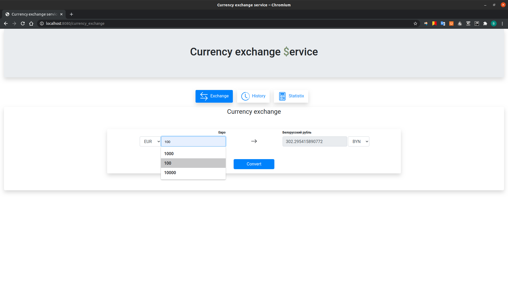
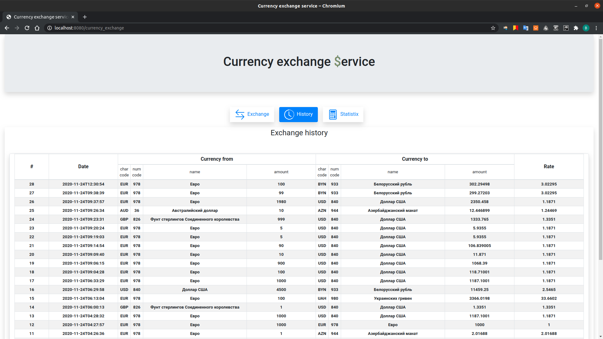
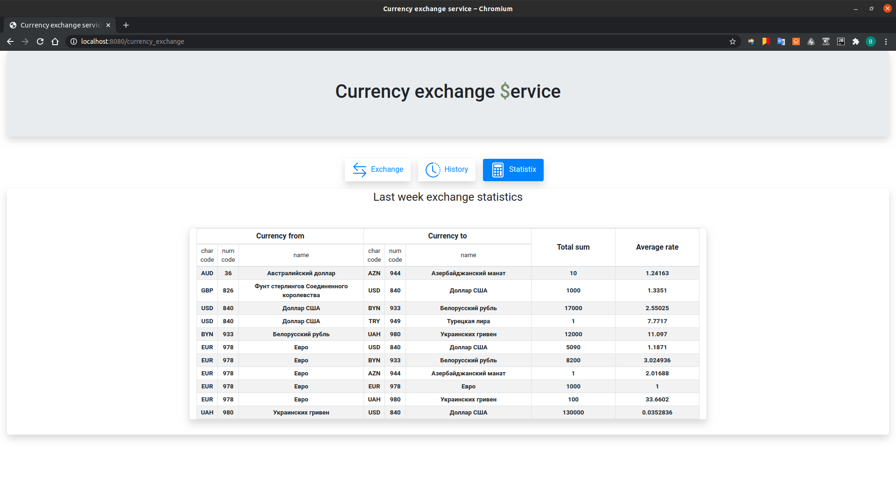

# Конвертер валют

### О приложении
Приложение позволяет производить конвертацию валют, используя их актуальные официальные курсы ЦБ РФ на момент выполнения операции.
Записи об операциях конвертирования сохраняются в базе данных и доступны для просмотра во вкладке ***History***.
Во вкладке ***Statistics*** для всех пар валют, с которыми производилась конвертация, приводится статистика за последнюю неделю: суммарный объём конвертаций и средний курс.<br/><br/>

### Требования
Для запуска приложения в системе необходимо иметь:
- ***Java*** версии не ниже ***11***
- сборщик ***Maven***
- подключение к СУБД ***PostgreSQL*** (разработка велась на версии ***13***)<br/><br/>

### Настройки базы данных
Для работы приложению требуется подключение к СУБД **PostgreSQL**. По умолчанию требуется наличие:
- локального сервера по адресу **localhost** с портом **5432**
- база данных **currency_exchange**
- пользователь **iteratia** с паролем **iteratiapwd**<br/>

В файле [_application.properties_][1] необходимо указать актуальные данные для подключения:
```properties
spring.datasource.url = jdbc:postgresql://[ХОСТ]:[ПОРТ]/[БАЗА_ДАННЫХ]
spring.datasource.username = [ИМЯ_ПОЛЬЗОВАТЕЛЯ]
spring.datasource.password = [ПАРОЛЬ]
```
<br/><br/>
### Запуск
Для запуска приложения нужно выполнить в терминале из корневой директории проекта команду
```Bash
$ mvn clean package && java -jar target/iteratia-1.0-fat.jar
```
а затем в браузере перейти по адресу _[http://localhost:8080/currency_exchange][2]_

> Для завершения работы приложения нужно нажать **кнопку (крест) в правом верхнем углу страницы** (а не вкладки браузера)!
> 
> В случае закрытия вкладки браузера приложение останется в памяти, продолжит работать и будет доступно при следующих переходах по адресу приложения!

<br/><br/>
### Веб интерфейс
На странице приложения располагаются вкладки:
- для выполнения конвертаций (***Exchange***)
- история произведённых операций (***History***)
- статистика по парам валют за неделю (***Statistics***)<br/>

При переходе на вкладку конвертации запрашиваются актуальные данные с _[сайта ЦБ РФ на текущий момент][3]_.<br/><br/>

#### Примеры:<br/>
<br/>
---
<br/>
---
<br/>
---

[1]: ./src/main/resources/application.properties
[2]: http://localhost:8080/currency_exchange
[3]: http://www.google.com/url?q=http%3A%2F%2Fwww.cbr.ru%2Fscripts%2FXML_daily.asp&sa=D&sntz=1&usg=AFQjCNHxvtm4FTBTV43XGvQAcOR0LKLh9w